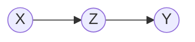
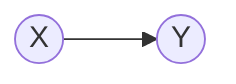
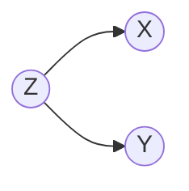

## VAEs

Variational autoencoders have the following graph structure. The inputs are encoded into some latent distribution decoded to match the output as closely as possible.

## Linear Regression

## My Approach

I restructure the graph such that both the inputs and outputs are generated from some latent space.

## Ideal Characteristics Linear Regression

- Ability to use an unlimited number of inputs
- Adding variables does not neccisarily improve the likelihood, but can also decrease the likelihood
- Exploit all information in the variables (e.g. do not test on significance)

# Review

## Process

$$
\begin{aligned}
X_i & = AZ_i + \epsilon_i \\
Y_i & = BZ_i + \epsilon'_i \\
\epsilon & \sim N(\mu, \Sigma) \\
\epsilon' & \sim N(\mu', \Sigma') \\
\end{aligned}

$$

### Parameters

$$
\begin{aligned}
X & : \textrm{(M x N) : input variables}\\
Z & : \textrm{(F x N) : latent variables}\\
Y & : \textrm{(P x N) : output variables}\\
A & : \textrm{(M x F) }\\
B & : \textrm{(P x F)}\\
\mu & : \textrm{(M x 1)}\\
\mu' & : \textrm{(P x 1)}\\
\Sigma & : \textrm{(M x M)}\\
\Sigma' & : \textrm{(P x P)} \\
N & : \textrm{number of observations} \\
M & : \textrm{number of input features} \\
P & : \textrm{number of output variables} \\
F & : \textrm{number of latent features}
\end{aligned}

$$

## Derivation

$$
\begin{aligned}
    \textrm{Objective : } \argmax_{\theta} p(Y|X;\theta)
\end{aligned}

$$

$$
\begin{aligned}
    p(Y|X) & = \frac{\int p(Y|Z)p(X|Z)p(Z)dZ}{p(X)} \\
\end{aligned}

$$

$$
\begin{aligned}
p(Z) & = (2\pi)^{-\frac{k}{2}} det(\Sigma)^{-\frac{1}{2}}e^{-\frac{1}{2} Z'Z} \\
& \propto e^{Z'Z}\\

p(X|Z) & = \prod_{t=1}^T (2 \pi)^{-\frac{M}{2}}det(\Sigma_X)^{-\frac{1}{2}}e^{-\frac{1}{2}(X_t-A Z_t)'\Sigma_X^{-1}(X_t - A Z_t)} \\
& \propto \prod_{t=1}^T det(\Sigma_X)^{-\frac{1}{2}}e^{-\frac{1}{2}(X_t-A Z_t)'\Sigma_X^{-1}(X_t - A Z_t)} \\
& = \prod_{t=1}^T det(\Sigma_X)^{-\frac{1}{2}}e^{-\frac{1}{2}(X_t-A \hat{Z}_t)'\Sigma_X^{-1}(X_t - A \hat{Z}_t) -\frac{1}{2}(Z_t-\hat{Z}_t)'A' \Sigma_X^{-1}A(Z_t - \hat{Z}_t)}\\
\end{aligned}

$$

$$
\begin{aligned}
p(Y|Z) & = \prod_{t=1}^T (2 \pi)^{-\frac{M}{2}}det(\Sigma_Y)^{-\frac{1}{2}}e^{-\frac{1}{2}(Y_t-B Z_t)'\Sigma_Y^{-1}(Y_t - B Z_t)} \\
& \propto \prod_{t=1}^T det(\Sigma_Y)^{-\frac{1}{2}}e^{-\frac{1}{2}(Y_t - B Z_t)'\Sigma_Y^{-1}(Y_T - B Z_t)} \\
& = \prod_{t=1}^T det(\Sigma_Y)^{-\frac{1}{2}}e^{-\frac{1}{2}(Y_t - B \hat{Z}_t)'\Sigma_Y^{-1}(Y_t - B \hat{Z}_t) -\frac{1}{2}(Z_t-\hat{Z}_t)' B' \Sigma_Y^{-1} B (Z_t - \hat{Z}_t)}\\
\end{aligned}

$$

$$
\begin{aligned}
p(X) & = \int p(X|Z) p(Z) dZ \\
& \propto \int e^{-\frac{1}{2} Z'Z} \prod_{t=1}^T det(\Sigma_X)^{-\frac{1}{2}} e^{-\frac{1}{2}(X_t-A \hat{Z}_t)'\Sigma_X^{-1}(X_t - A \hat{Z}_t) -\frac{1}{2}(Z_t-\hat{Z}_t)'A' \Sigma_X^{-1}A(Z_t - \hat{Z}_t)} dZ \\
& =  \prod_{t=1}^T \int det(\Sigma_X)^{-\frac{1}{2}}e^{-\frac{1}{2}(X_t-A \hat{Z}_t)'\Sigma_X^{-1}(X_t - A \hat{Z}_t) -\frac{1}{2}(Z_t-\hat{Z}_t)'A' \Sigma_X^{-1}A(Z_t - \hat{Z}_t)-\frac{1}{2} Z_t'Z_t} dZ_t \\
& = det(\Sigma_X)^{-\frac{T}{2}} det(\Sigma')^{\frac{T}{2}}
\prod_{t=1}^T \Big( e^{-\frac{1}{2}(X_t-A \hat{Z}_t)'\Sigma_X^{-1}(X_t - A \hat{Z}_t)} \Big) \\
\Sigma' & = (I + A' \Sigma_X^{-1} A)^{-1}
\end{aligned}

$$

$$
\begin{aligned}
p(Y|Z)p(Z|X)p(Z) & \propto det(\Sigma_Y)^{-\frac{1}{2}}e^{-\frac{1}{2}(Y - B \hat{Z})'\Sigma_Y^{-1}(Y - B \hat{Z}) -\frac{1}{2}(Z-\hat{Z})' B' \Sigma_Y^{-1} B (Z - \hat{Z})}
det(\Sigma_X)^{-\frac{1}{2}}e^{-\frac{1}{2}(X-A \hat{Z})'\Sigma_X^{-1}(X - A \hat{Z}) -\frac{1}{2}(Z-\hat{Z})'A' \Sigma_X^{-1} A(Z - \hat{Z})}
e^{-\frac{1}{2} Z'Z} 
\end{aligned}

$$

$$
\begin{aligned}
\int p(Y|Z)p(Z|X)p(Z) dZ & \propto \int 
e^{-\frac{1}{2} Z'Z}
\prod_{t=1}^T
det(\Sigma_X)^{-\frac{1}{2}} det(\Sigma_Y)^{-\frac{1}{2}}  
e^{-\frac{1}{2}(Y - B \hat{Z})'\Sigma_Y^{-1}(Y - B \hat{Z})-\frac{1}{2}(X-A \hat{Z})'\Sigma_X^{-1}(X - A \hat{Z})}
e^{ -\frac{1}{2}(Z-\hat{Z}_t)' B' \Sigma_Y^{-1} B (Z_t - \hat{Z}_t)-\frac{1}{2}(Z_t-\hat{Z}_t)'A' \Sigma_X^{-1} A(Z_t - \hat{Z}_t)} dZ\\
& = det(\Sigma_X)^{-\frac{T}{2}} det(\Sigma_Y)^{-\frac{T}{2}} 
\prod_{t=1}^T
\Big(
e^{-\frac{1}{2}(Y_t - B \hat{Z}_t)'\Sigma_Y^{-1}(Y_t - B \hat{Z}_t)-\frac{1}{2}(X_t-A \hat{Z}_t)'\Sigma_X^{-1}(X_t - A \hat{Z}_t)}
\Big)
\int \prod_{t=1}^T e^{ -\frac{1}{2}(Z_t-\hat{Z}_t)' B' \Sigma_Y^{-1} B (Z_t - \hat{Z}_t)-\frac{1}{2}(Z_t-\hat{Z}_t)'A' \Sigma_X^{-1} A(Z_t - \hat{Z}_t)-
\frac{1}{2}Z_t'Z_t} dZ \\

& = det(\Sigma_X)^{-\frac{T}{2}} det(\Sigma_Y)^{-\frac{T}{2}} 
\prod_{t=1}^T
\Big(
e^{-\frac{1}{2}(Y_t - B \hat{Z}_t)'\Sigma_Y^{-1}(Y_t - B \hat{Z}_t)-\frac{1}{2}(X_t-A \hat{Z}_t)'\Sigma_X^{-1}(X_t - A \hat{Z}_t)}
\Big)
\prod_{t=1}^T
\int e^{ -\frac{1}{2}(Z_t-\hat{Z}_t)' B' \Sigma_Y^{-1} B (Z_t - \hat{Z}_t)-\frac{1}{2}(Z_t-\hat{Z}_t)'A' \Sigma_X^{-1} A(Z_t - \hat{Z}_t)-
\frac{1}{2}Z_t'Z_t} dZ_t \\

& = det(\Sigma_X)^{-\frac{T}{2}} det(\Sigma_Y)^{-\frac{T}{2}} 
\prod_{t=1}^T
\Big(
e^{-\frac{1}{2}(Y_t - B \hat{Z}_t)'\Sigma_Y^{-1}(Y_t - B \hat{Z}_t)-\frac{1}{2}(X_t-A \hat{Z}_t)'\Sigma_X^{-1}(X_t - A \hat{Z}_t)}
\Big)
\prod_{t=1}^T
\int e^{ -\frac{1}{2}(Z_t-\hat{Z}_t)' B' \Sigma_Y^{-1} B (Z_t - \hat{Z}_t)-\frac{1}{2}(Z_t-\hat{Z}_t)'A' \Sigma_X^{-1} A(Z_t - \hat{Z}_t)-
\frac{1}{2}Z_t'Z_t} dZ_t \\

& \propto det(\Sigma_X)^{-\frac{T}{2}} det(\Sigma_Y)^{-\frac{T}{2}} 
det(\Sigma)^{\frac{T}{2}}
\prod_{t=1}^T
\Big(
e^{-\frac{1}{2}(Y_t - B \hat{Z}_t)'\Sigma_Y^{-1}(Y_t - B \hat{Z}_t)-\frac{1}{2}(X_t-A \hat{Z}_t)'\Sigma_X^{-1}(X_t - A \hat{Z}_t)}
\Big) \\ 
\Sigma & = (I + A'\Sigma_X^{-1}A + B'\Sigma_Y^{-1}B)^{-1} 
\end{aligned}

$$

$$
\begin{aligned}
    p(Y|X;\Sigma_X, \Sigma_Y, \hat{Z}) & = \frac{\int p(Y|Z)p(X|Z)p(Z)dZ}{p(X)} \\
    & \propto det(\Sigma_Y)^{-\frac{T}{2}} 
det(\Sigma)^{\frac{T}{2}} det(\Sigma')^{-\frac{T}{2}}
\prod_{t=1}^T
\Big(
e^{-\frac{1}{2}(Y_t - B \hat{Z}_t)'\Sigma_Y^{-1}(Y_t - B \hat{Z}_t)}
\Big) \\ 
\Sigma & = (I + A'\Sigma_X^{-1}A + B'\Sigma_Y^{-1}B)^{-1} \\
\Sigma' & = (I + A' \Sigma_X^{-1} A)^{-1}
\end{aligned}

$$

$$
\begin{aligned}
    \log{p(Y|X)} & = \frac{T}{2} \log{|\Sigma_Y^{-1}|}
    - \frac{T}{2}\log{|I + A' \Sigma_X^{-1} A + B' \Sigma_Y^{-1} B|} + \frac{T}{2}\log{|I + A'\Sigma_X^{-1}A|} - \frac{1}{2} \sum_{t=1}^T (Y_t - B \hat{Z}_t)'\Sigma_Y^{-1}(Y_t - B \hat{Z}_t)
\end{aligned}

$$

[link](https://math.stackexchange.com/questions/2867022/derivation-of-derivative-of-multivariate-gaussian-w-r-t-covariance-matrix)

[first order deriviative](https://math.stackexchange.com/questions/2083410/the-relation-between-trace-and-determinant-of-a-matrix)

[example with trace](https://math.stackexchange.com/questions/2404427/derivative-of-a-trace-and-log-determinant)

[derivatives in a trace](https://web.stanford.edu/~jduchi/projects/matrix_prop.pdf) (first order approximation)

$$
\begin{aligned}
    \frac{\partial p(Y|X)}{\partial B} & = ... + \frac{1}{2} \sum_{t=1}^T  2 \Sigma_Y^{-1} (Y_t - B \hat{Z}_t)B'
\end{aligned}

$$

$$
\begin{aligned}
    \frac{\partial p(Y|X)}{\partial A} & = ... + \frac{1}{2} \sum_{t=1}^T  2 \Sigma_Y^{-1} (Y_t - B \hat{Z}_t)B'
\end{aligned}

$$

$$
\begin{aligned}
    \frac{\log{p(Y|X)}}{\partial \Sigma_Y^{-1}} & = \frac{T}{2} \Sigma_Y + ... - \frac{1}{2} \sum_{t=1}^T (Y_t - B \hat{Z}_t)(Y_t - B \hat{Z}_t)'
\end{aligned}

$$

$$
\begin{aligned}
    \frac{\partial \log{p(Y|X)}}{\partial \hat{Z}} & = 
\end{aligned}

$$

## Decomposition Rule

$$
\begin{aligned}
(Y-XB)'(Y-XB) & = (Y-X \hat{B})'(Y-X \hat{B}) + (B - \hat{B})'X'X (B - \hat{B})
\end{aligned}

$$

$$
\begin{aligned}
X & : \textrm{M x N}\\
A & : \textrm{M x F}\\
Z & : \textrm{F x N}\\ 
\end{aligned}

$$

$$
\begin{aligned}
p(Z|X) & \propto p(X|Z) p(Z)\\
p(Z) & \sim N(0, I) \\
& = (2 \pi)^{-\frac{M}{2}}e^{-\frac{1}{2}Z'Z}\\
p(X|Z) & = (2 \pi)^{-\frac{M}{2}}det(\Sigma)^{-\frac{1}{2}}e^{-\frac{1}{2}(X-A Z)'\Sigma^{-1}(X - A Z)} \\
p(Z|X) & \propto (2 \pi)^{-\frac{M+F}{2}} det(\Sigma)^{-\frac{1}{2}} e^{-\frac{1}{2}(X-AZ)'\Sigma^{-1}(X-AZ)-\frac{1}{2}Z'Z}\\
& \propto e^{-\frac{1}{2} (X-A\hat{Z})\Sigma^{-1}(X-A\hat{Z}) - \frac{1}{2}(Z-\hat{Z})A'\Sigma^{-1}A(Z-\hat{Z}) -\frac{1}{2} Z'Z} \\
p(Y|Z) & \propto e^{-\frac{1}{2}(Y-BZ)\Sigma^{-1}(Y-BZ)} \\
& = e^{-\frac{1}{2} (Y-B\hat{Z})\Sigma^{-1}(Y-B\hat{Z})-\frac{1}{2}(Z-\hat{Z})B'\Sigma^{-1}B(Z-\hat{Z}) } \\
p(Y|X) & = \int p(Y,Z|X) dZ \\
& = \int p(Y|Z) p(Z|X) dZ\\
& = \int (2 \pi)^{-\frac{P}{2}}det(\Sigma')^{-\frac{1}{2}}e^{-\frac{1}{2}(Y-B Z)'\Sigma'^{-1}(Y-B Z)} (2 \pi)^{-\frac{M}{2}}det(\Sigma)^{-\frac{1}{2}}e^{-\frac{1}{2}(X-A Z)'\Sigma^{-1}(X - A Z)} dZ \\
& = \int (2 \pi)^{-\frac{P}{2}}det(\Sigma')^{-\frac{1}{2}}e^{-\frac{1}{2}(Y-B Z)'\Sigma'^{-1}(Y-B Z)} (2 \pi)^{-\frac{M}{2}}det(\Sigma)^{-\frac{1}{2}}e^{-\frac{1}{2}(A Q-A Z)'\Sigma^{-1}(A Q - A Z)} dZ \\
& = \int (2 \pi)^{-\frac{P}{2}}det(\Sigma')^{-\frac{1}{2}}e^{-\frac{1}{2}(A A^{-1} Y - A B Z)'\Sigma'^{-1}(A A^{-1} Y - A B Z)} (2 \pi)^{-\frac{M}{2}}det(\Sigma)^{-\frac{1}{2}}e^{-\frac{1}{2}(A Q-A Z)'\Sigma^{-1}(A Q - A Z)} dZ \\
p(Z|X) & = \frac{p(X|Z)p(Z)}{p(X)} = \frac{p(X|Z)p(Z)}{\int p(X|Z) p(Z) dZ} \\
p(Y|X) & = \frac{\int p(Y|Z)p(X|Z)p(Z)dZ}{\int p(X|Z) p(Z) dZ} \\
p(Z) & \sim N(0, \sigma^2 I)
\end{aligned}

$$

<!-- 
p(Y|X) = \int p(Y|Z;B,\mu',\Sigma') p(Z|X) dZ_i
\end{aligned} -->

Parameters:

$$
A, B, \Sigma, \Sigma', \mu, \mu'

$$

Multivariate Gaussian Distribution

$$
\begin{aligned}
p(x) & = (2 \pi)^{-\frac{k}{2}}det(\Sigma)^{-\frac{1}{2}}e^{-\frac{1}{2}(x-\mu)'\Sigma^{-1}(x-\mu)}
\end{aligned}

$$

## Bayesian Regression

### Univariate

Process

$$
\begin{aligned}
y &= X \beta + \epsilon
\end{aligned}

$$

Assume flat priors

$$
\begin{aligned}
p(\beta) & \propto 1 \\
p(\sigma^2) & \propto \sigma^{-2}
\end{aligned}

$$

Bayesian prediction

$$
\begin{aligned}
y & = X \beta + \epsilon\\
p(y|X) & = \int p(Y, \beta, \sigma^2|X) d\beta d\sigma^2 \\
& = \int p(Y|X, \beta, \sigma^2) p(\beta, \sigma^2 | X) d\beta d\sigma^2
\end{aligned}

$$

$$
\begin{aligned}
p(\sigma^2|y) & \propto \sigma^{-(N+2-k)} e^{-\frac{1}{2 \sigma^2}(y - X \hat{\beta})'(y - X\hat{\beta})}
\end{aligned}

$$

## Singular Value Decomposition

$$
\begin{aligned}

M & = U \Sigma V*\\
\textrm{where} \\
M & : \textrm{M x N} \\
U & : \textrm{M x M} \\
\Sigma & : \textrm{M x N} \\
V^* & : \textrm{N x N} \\
\end{aligned}

$$

### Estimating Covariance matrix

[link](https://xavierbourretsicotte.github.io/MLE_Multivariate_Gaussian.html)
